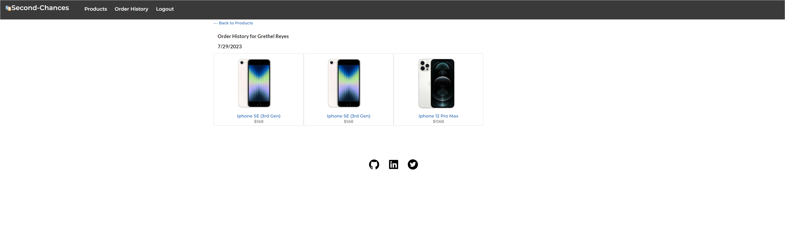

# Second-Chances

## Description

This e-commerce website is selling refurbished phones of different brands and models. Customers can view all the products available and filtered their search by brand. Any product of choice can be added to the cart for purchase. Users can also create an account and history of their order will be saved in their profile.

## Table of Contents

* [Technologies Used](#Technologies-Used)    
* [Screenshots](#Screenshots) 
* [Deployed App](#Deployed-App) 
* [License](#License)    
* [Questions](#Questions)

## Technologies Used

 
  
 &nbsp;&nbsp;&nbsp;&nbsp;&nbsp;&nbsp;&nbsp;&nbsp;
  
 &nbsp;&nbsp;&nbsp;&nbsp;&nbsp;&nbsp;&nbsp;&nbsp;
  
  &nbsp;&nbsp;&nbsp;&nbsp;&nbsp;&nbsp;&nbsp;&nbsp;
 
 &nbsp;&nbsp;&nbsp;&nbsp;&nbsp;&nbsp;&nbsp;&nbsp;
 
 &nbsp;&nbsp;&nbsp;&nbsp;&nbsp;&nbsp;&nbsp;&nbsp;
 
 &nbsp;&nbsp;&nbsp;&nbsp;&nbsp;&nbsp;&nbsp;&nbsp;
 
 &nbsp;&nbsp;&nbsp;&nbsp;&nbsp;&nbsp;&nbsp;&nbsp;
  
 &nbsp;&nbsp;&nbsp;&nbsp;&nbsp;&nbsp;&nbsp;
  
 &nbsp;&nbsp;&nbsp;&nbsp;&nbsp;&nbsp;&nbsp;&nbsp;
  
  &nbsp;&nbsp;&nbsp;&nbsp;&nbsp;&nbsp;&nbsp;&nbsp;

  
  
 

## Screeshots

Home Page 

Products Page 

Cart 

Signup Page 

Login Page 

Order History

## Deployed App

Link to the deployed app on Heroku: [https://calm-woodland-64792-028af22f22df.herokuapp.com/]

## License

Licensed under the [MIT](./LICENSE) license.

## Questions
    
If you have any questions about the project please contact me through my [GitHub](https://github.com/Garethus) or email me at reyes.grethelmaec@gmail.com.

